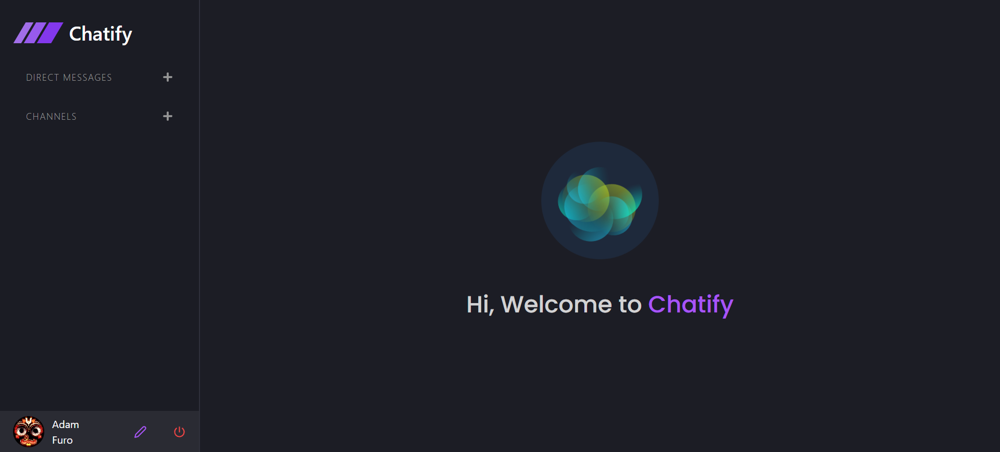
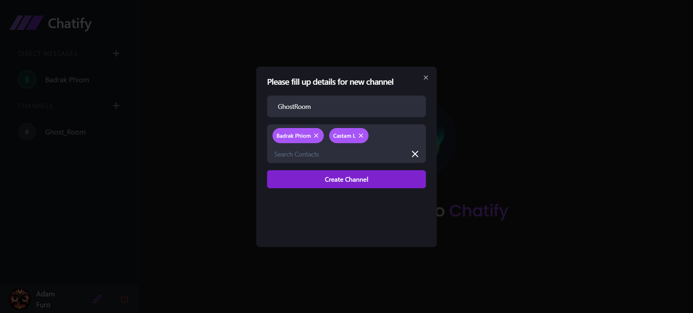

# React + Vite

This template provides a minimal setup to get React working in Vite with HMR and some ESLint rules.

Currently, two official plugins are available:

- [@vitejs/plugin-react](https://github.com/vitejs/vite-plugin-react/blob/main/packages/plugin-react/README.md) uses [Babel](https://babeljs.io/) for Fast Refresh
- [@vitejs/plugin-react-swc](https://github.com/vitejs/vite-plugin-react-swc) uses [SWC](https://swc.rs/) for Fast Refresh

  

## Screens
- SigbIn or SignUp Screen
- Chat Screen
- Profile Setup Screen
   
## Backend of the Project: https://github.com/Rounak00/Chatify_server
  
## Quick Glimpses of the site : 

 <table>
  <tr>
    <td>Auth Page </td>
    <td>Profile Setup Page</td>
  </tr>
  <tr>
    <td>Non Selected Chat Page</td>
    <td>Search Contact</td>
  </tr>
  <tr>
    <td colspan="2">Selected Chat Pagee</td>
  </tr>
<tr>
    <td>Image Viewer Component</td>
    <td>Upload File Component</td>
  </tr>
<tr>
    <td>Group Create Component</td>
    <td>Group Chat Component</td>
  </tr>

 </table>
